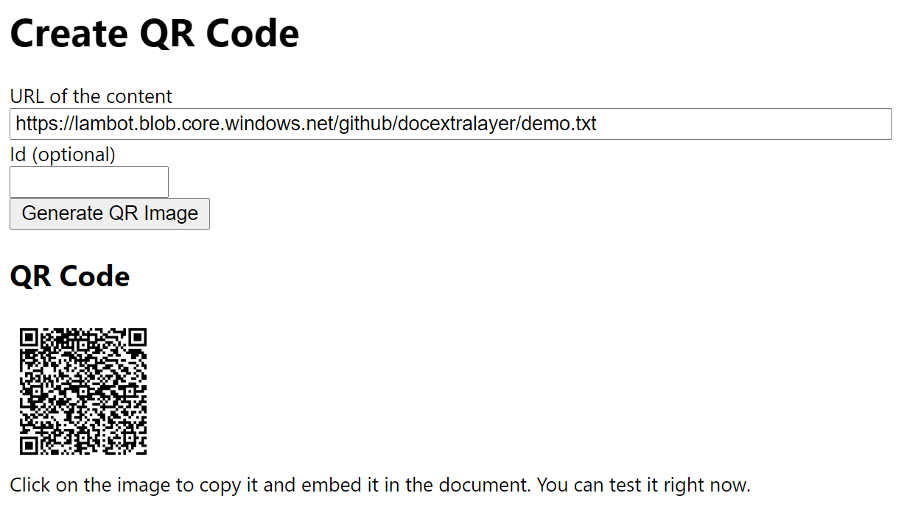

# DocExtraLayer
Add an extra layer of information to your document by embedding a QRCode in your doc that unleashes a more complete experience.

Imagine you receive a Powerpoint or a Word document or an Excel sheet or... well, any document, and you find a QRCode. You take your phone, point at it and you now have access to a richer content connected to that slide or section.

Nothing new you would think, that's why we have QR codes! This project is just to make this process simple and out of the box so anyone can do this in seconds.

Here are the simple steps:

1. Create a public data file with the content you want to share

    Example, save this a file with this content in a public Azure storage:
    ```
    Thank you for checking the QR Code
    ```
    Note that the location should have "no-cors" enabled

2. Create the QRCode pointing to the content location

    Go to this [link](https://lambot.blob.core.windows.net/github/docextralayer/create.html), fill the form and generate the QR code.

    

3. Copy and paste the QRCode to your document and share it.

Now test it and play with it!

As your content is just plain text, the only thing the QRCode can do it to read it aloud for you. If you are embedding a slide, it could read some text like if you would be presenting it to the audience. 

What if you would like to share links or video or...?
We need to make the content richer and still simple to use.

### Making it richer

Your content can be enriched by adding some special control chars. You just need to start the file with the pragma #QR and then use instructions to apply to the content like #Read or #Play

```
#QR:
#Share
More on kittens
https://en.wikipedia.org/wiki/Kitten
#Show
Demo of the DocExtraLayer solution
#Read
Life is good!
#Play
https://www.youtube.com/embed/Z8XP7UjzvnU
#Share
more on kittens
```

You can have one pragma per line and the available pragmas are:

*#Read* - Read the following text

*#Play* - Play the media. For Youtube videos ue the embeded URL.

*#Show* - display the content

*#Share* - Share content, using the device's native share capability. 

### Deploying this in your domain

Customer will prefer to see this embeded in your site. You just need to deploy the file readqrcode.html in your domain and point the baseURL var in create.html to the readqrcode.html address:

```
    const baseURL="https://<your url>/readqrcode.html";
```

### To debug the request

A debug region will be displayed if you add *debug=true* to the readqrcode query string.

```
http://localhost/readqrcode.html?d=./demo.txt&i=&debug=true
```
